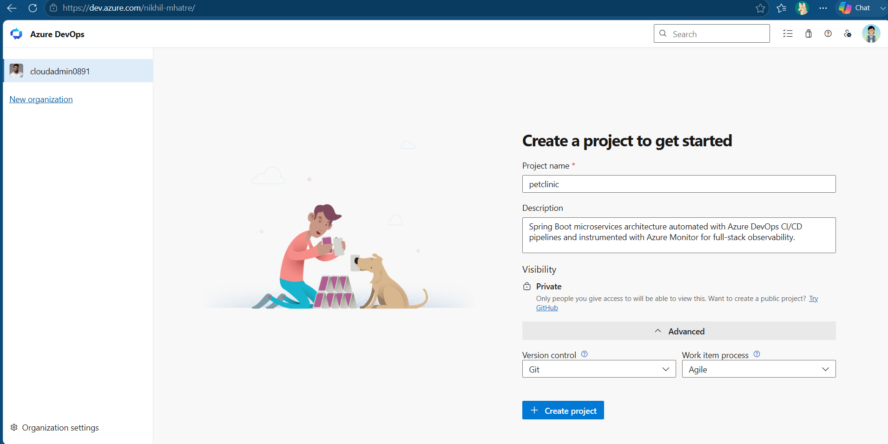
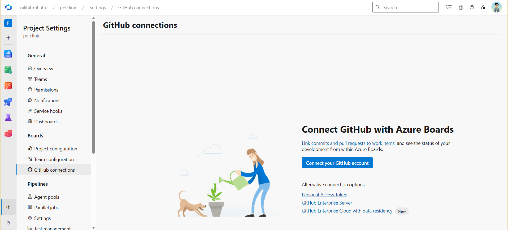
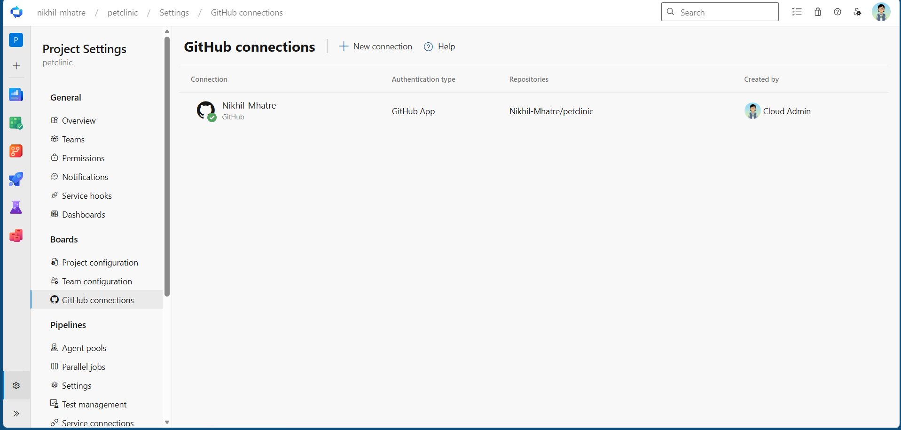
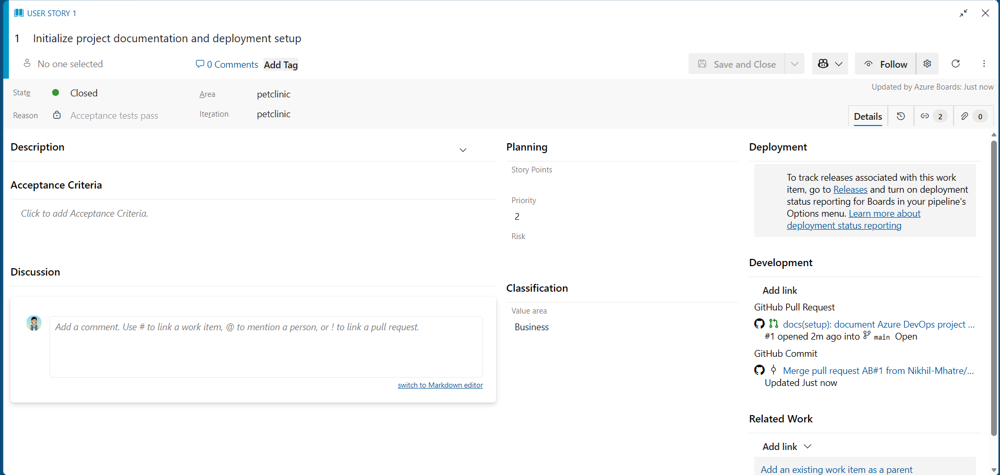

# Azure DevOps Deployment Guide

## 1. Create Project in Azure DevOps

Follow these steps to initialize your project workspace in Azure DevOps:

### Prerequisites & Organization Setup

1. Open your browser and navigate to [Azure DevOps](https://dev.azure.com).
2. Select your existing organization (e.g., `dev.azure.com/nikhil-mhatre` or `dev.azure.com/<your-organization-name>`).
   - _If you do not have an organization yet, select **Create new organization**, enter your desired organization name, choose your preferred cloud region, and proceed._

---

### Project Configuration Steps

1. On the Organization landing page, click the **+ New project** button in the top-right corner.
2. Fill in the following project parameters:

| Configuration Field | Value                                                                                           | Description / Purpose                                                                                              |
| ------------------- | ----------------------------------------------------------------------------------------------- | ------------------------------------------------------------------------------------------------------------------ |
| **Project name**    | `petclinic`                                                                                     | Matches the Spring PetClinic microservices application workspace.                                                  |
| **Description**     | `Containerized Spring Boot microservices deployment pipeline with Azure Monitor observability.` | Explains the project's technical scope to evaluators and team members.                                             |
| **Visibility**      | `Private`                                                                                       | Keeps pipeline configurations private within Azure DevOps while referencing your public/private GitHub repository. |

3. Expand the **Advanced** settings panel at the bottom of the dialog:

| Advanced Setting      | Selected Option | Description / Purpose                                                                         |
| --------------------- | --------------- | --------------------------------------------------------------------------------------------- |
| **Version control**   | `Git`           | Standard distributed version control system.                                                  |
| **Work item process** | `Agile`         | Uses User Stories, Tasks, and Sprints—matching industry-standard agile engineering workflows. |

4. Click **Create**. Azure DevOps will provision your project workspace and navigate to the project dashboard.

---

### Verification Screenshot

_Figure 1.1: Project creation modal in Azure DevOps with name, description, private visibility, Git version control, and Agile process selected._

## 2. Connect GitHub Repository to Azure Boards

This section covers configuring the bidirectional integration between GitHub and Azure Boards to enable Agile work item tracking, automated commit linking, and sprint traceability.

---

### 2.1 Establish GitHub Connection in Azure DevOps

1. In your Azure DevOps `petclinic` project, click **Project settings** (gear icon at the bottom-left corner).
2. Under the **Boards** section in the left navigation sidebar, select **GitHub connections**.
3. Click **Connect your GitHub account** (or **New connection**).
4. Select **OAuth** or authenticate directly with your GitHub credentials (`nikhil-mhatre`).
5. Authorize the **Azure Boards** integration application.

_Figure 2.1: Authorizing GitHub repository access within Azure Boards settings._

---

### 2.2 Select and Map the Target Repository

1. In the repository selection modal, search for and select the **`petclinic`** repository (`<your-github-username>/petclinic`).
2. Click **Save**.
3. When redirected to GitHub, select **Only select repositories**, choose `petclinic`, and click **Approve and Install**.
4. Confirm that `petclinic` appears under **GitHub connections** with an **Active** status.

_Figure 2.2: Repository successfully mapped and active for work item tracking._

---

### 2.3 Agile Traceability & Commit Syntax Rules

With the integration configured, referencing an Azure Boards Work Item ID in Git commit messages or Pull Request descriptions automatically creates links inside Azure Boards.

| Syntax Pattern   | Example Commit Message                                  | Result in Azure Boards                                                                                    |
| ---------------- | ------------------------------------------------------- | --------------------------------------------------------------------------------------------------------- |
| `AB#<ID>`        | `docs(setup): update integration steps AB#1`            | Links commit to Work Item #1 without modifying state.                                                     |
| `Fixes AB#<ID>`  | `feat(api): add routing logic Fixes AB#2`               | Links commit and automatically transitions Work Item #2 to **Closed / Resolved** when merged into `main`. |
| `Closes AB#<ID>` | `fix(core): resolve null pointer exception Closes AB#3` | Links commit and marks Work Item #3 as completed upon merge.                                              |

---

### 2.4 Verification Screenshot

_Figure 2.3: Work item in Azure Boards showing GitHub commit and branch activity under the Development panel._
